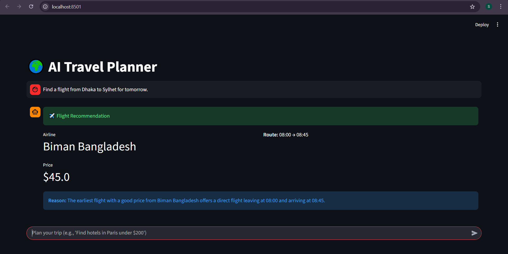
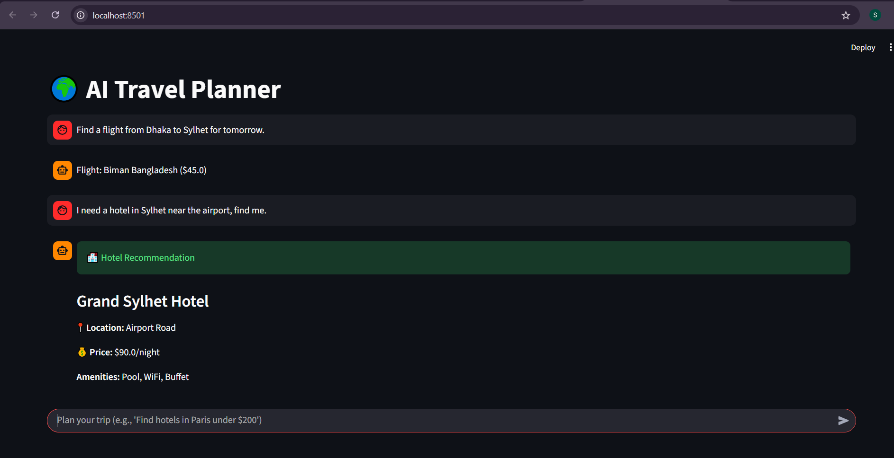
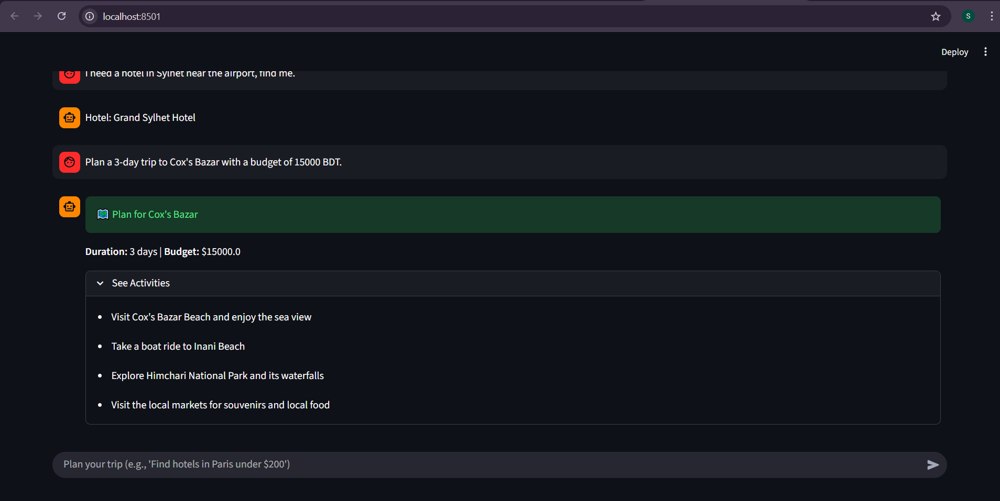
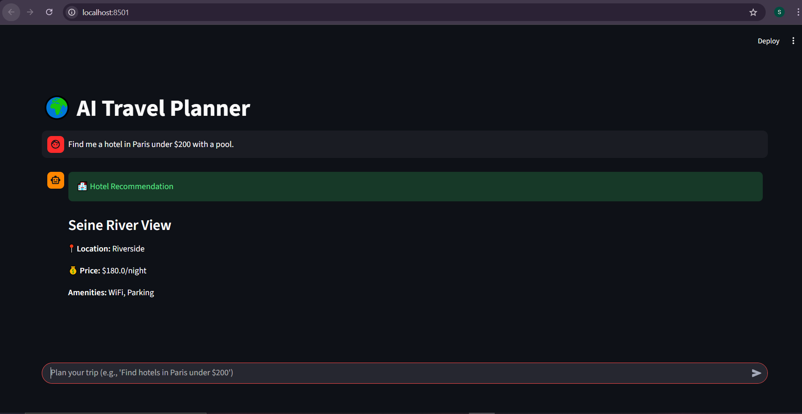

# 🌍 AI Travel Planner (Multi-Agent System)

An intelligent **Travel Agent System** built with **FastAPI**, **Streamlit**, and **OpenAI's LLM**. This project utilizes a **Multi-Agent Architecture** where specialized agents (Flight Expert, Hotel Specialist, and Travel Planner) collaborate to provide comprehensive travel solutions autonomously.

## 🚀 Key Features

* **🤖 Multi-Agent Architecture:** A main orchestrator agent intelligently routes user queries to specialized agents.
* **✈️ Flight Specialist Agent:** Finds flights based on dynamic destinations and dates using custom tools.
* **🏨 Hotel Specialist Agent:** Recommends hotels based on specific cities (e.g., Sylhet, Cox's Bazar, Paris) and budget constraints.
* **🗺️ Travel Planner Agent:** Generates detailed day-to-day itineraries with budget breakdowns and activity suggestions.
* **🐳 Fully Dockerized:** Seamless deployment using Docker and Docker Compose.
* **💻 Interactive UI:** User-friendly chat interface built with Streamlit.

## 🛠️ Tech Stack

* **Language:** Python 3.11
* **Backend Framework:** FastAPI (Asynchronous API)
* **Frontend Framework:** Streamlit
* **LLM Integration:** OpenAI (GPT-4o / GPT-3.5-turbo)
* **Data Validation:** Pydantic
* **Containerization:** Docker & Docker Compose

⚙️ Installation & Setup
Prerequisites
Git

Docker Desktop (Recommended) OR Python 3.10+

OpenAI API Key

**Run Locally (Without Docker)**
Create Virtual Environment:
python -m venv env
# Windows:
env\Scripts\activate

Install Dependencies:
pip install -r requirements.txt

Run Backend (Terminal 1):
uvicorn main:app --reload

Run Frontend (Terminal 2):
streamlit run StreamlitApp.py

How It Works
User Query: The user asks, "Plan a 3-day trip to Sylhet with a budget of 15000 BDT."

Intent Recognition: The Travel Planner Agent analyzes the request. Since it requires a full plan, it generates the itinerary using its internal knowledge base and tools.

Specialist Hand-off: If the user then asks "Find hotels in Sylhet", the system recognizes the need for specific accommodation data and hands off the task to the Hotel Specialist.

Structured Response: The backend returns structured JSON data (pydantic models), which the Streamlit frontend renders into beautiful UI cards (Flight tickets, Hotel details).

📸 Screenshots
Here are the results from the AI Travel Planner:

### 1. Flight Search Result

### 2. Hotel Recommendation

### 3. Travel Activites Plan 

### 4. Additional Result
